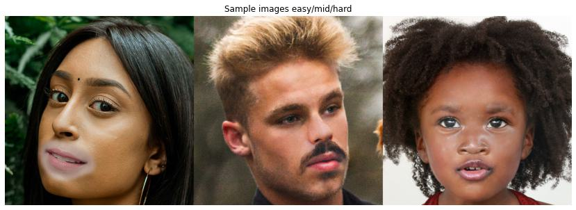
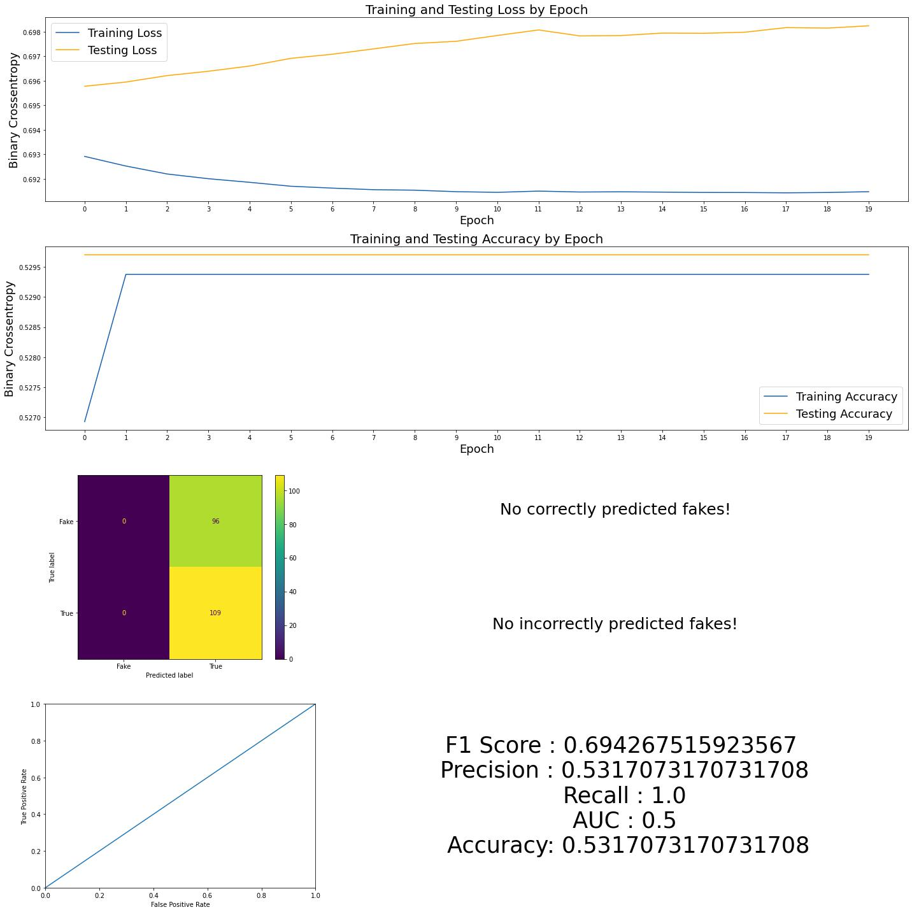
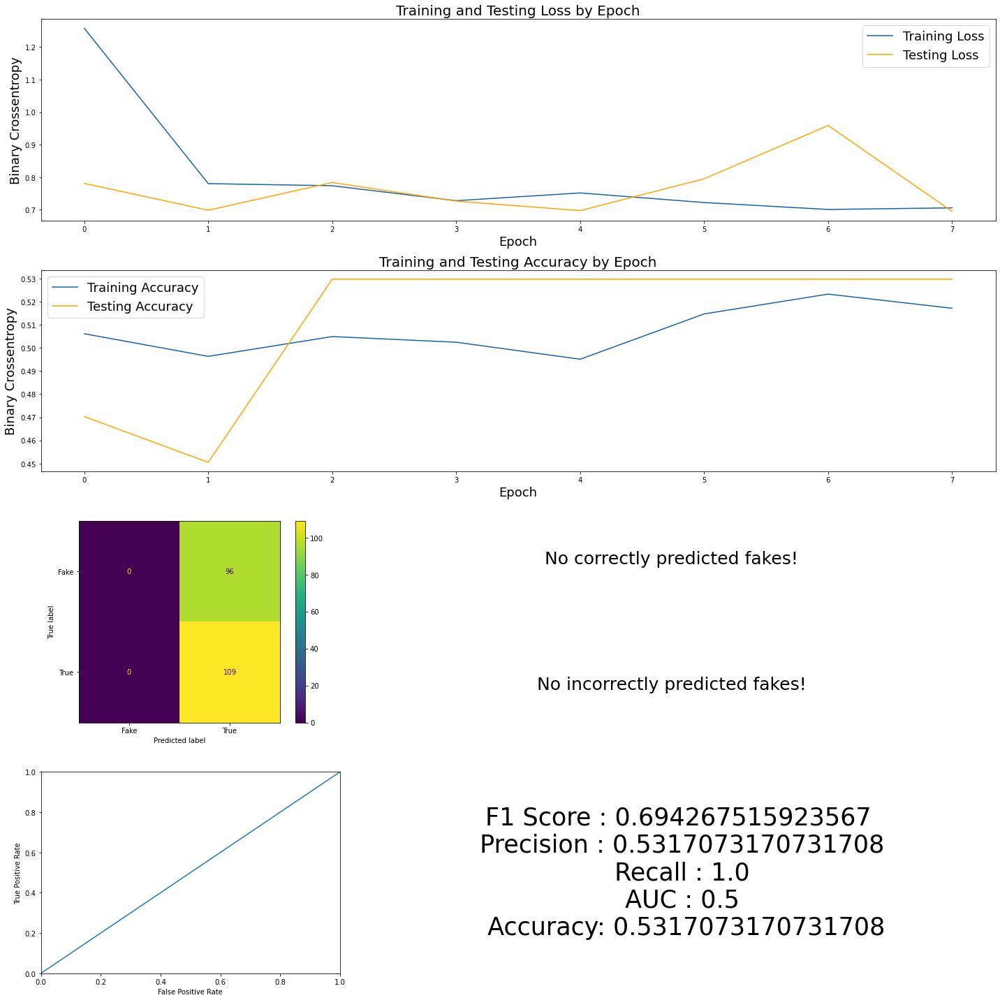
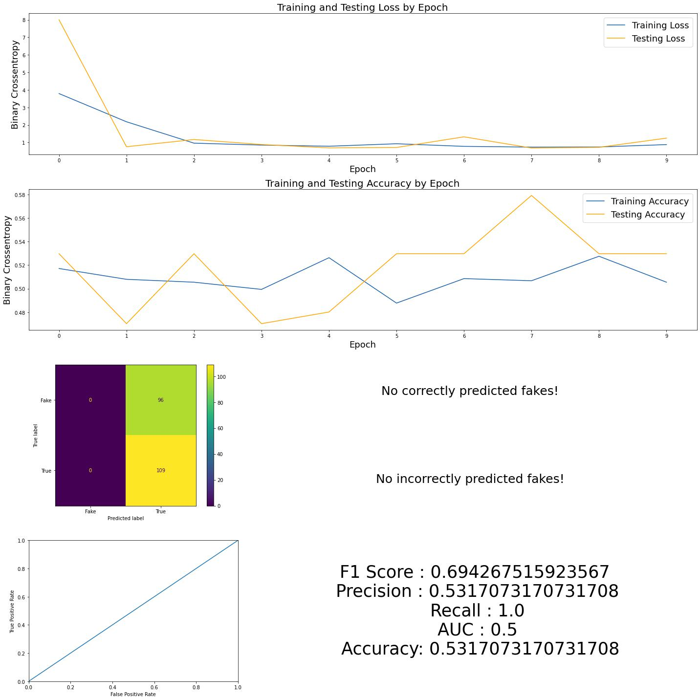
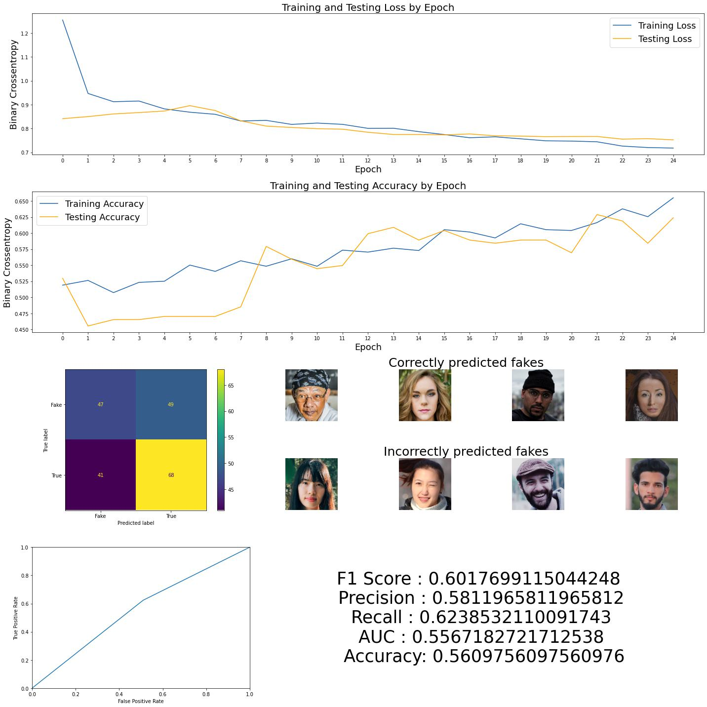
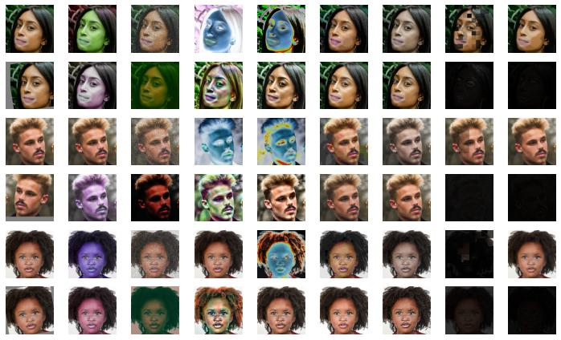
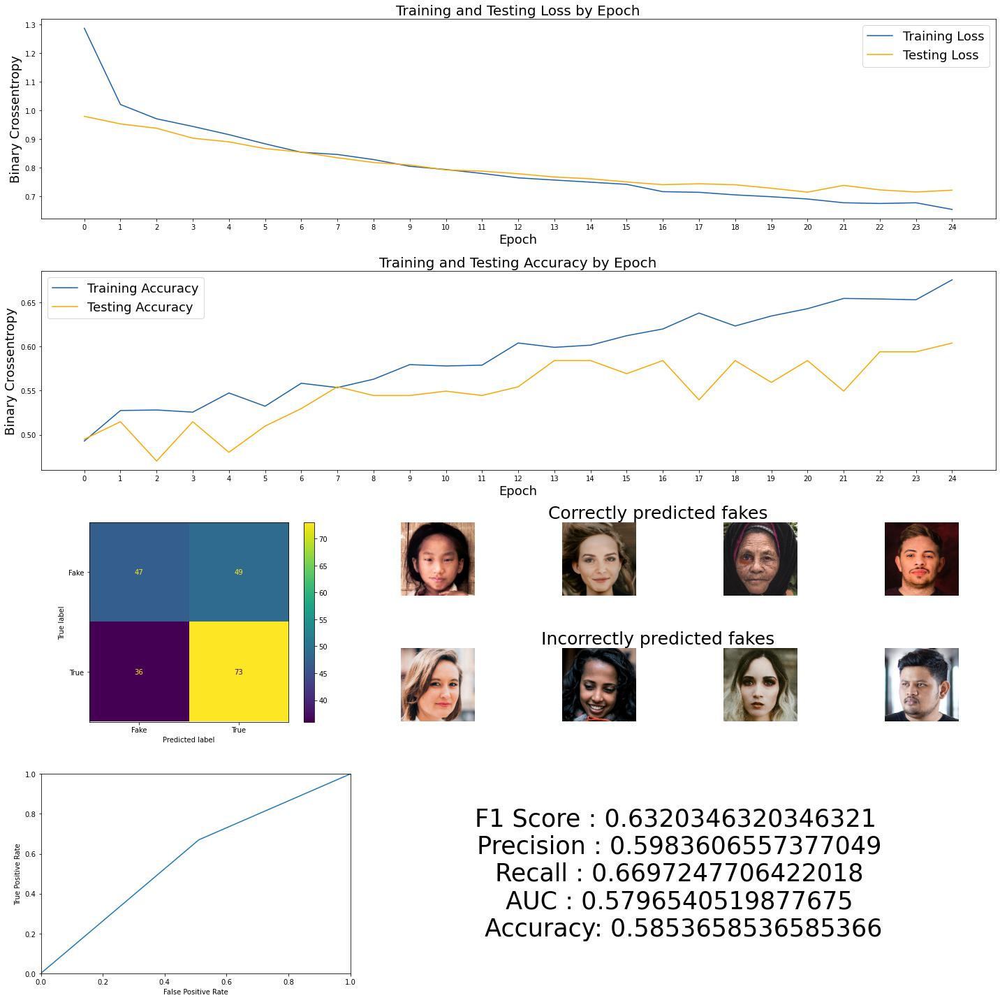

#                                                  
# Final Project : Detecting Fake Images with Convolution Neural Network

[Problem Statement](#problem-statement)\
[Brief Summary of Analysis and Interpretations](#brief-summary-of-analysis-and-interpretations)\
[1. Simple Convolution Neural Network](#1-simple-convolution-neural-network)\
[2. VGG Pretrained Convolution Neural Network](#2-vgg-pretrained-convolution-neural-network)\
[3. EfficientNetB4 Pretrained Convolution Neural Network](#3-efficientnetb4-pretrained-convolution-neural-network)\
[4. Custom Convolution Neural Network](#4-custom-convolution-neural-network)\
[4.5 Custom Convolution Neural Network with data Augmentation](#45-custom-convolution-neural-network-with-data-augmentation)\
[Summary Results Table](#summary-results-table)\
[Next steps](#next-steps)\
[Conclusions](#Conclusions)

### Problem Statement
In the past few years, there has been a significant increase in the creation of fake accounts with artificially generated images on the Facebook. Company would like to find a way to solve this problem without employee participation, since such approach is costly and ineffective. As a data scientist working for Meta, I have been tasked to solve this issue by building a classifying model that could detect fake images. As an input, model should get image containing user's face and predict whether it is real or not.
Project success will be evaluated using resulting accuracy. Resulting score should be as high as possible, but not lower than baseline 53 percent for accuracy for a given dataset. Despite the fact, that dataset contains different levels of fake quality images, for the purposes of this project we will use binary classification, since there is no need for the company to predict how complicated for the model was to generate predicting result.

## Brief Summary of Analysis and Interpretations
For solving the stated problem, I was provided with a dataset of images, contains **960** fake and **1081** real images, **2041** in total. Baseline accuracy is **52.9%**. Each image has a resolution 600x600 pixels with 3 color channels.

 
And here are some examples of fake images: 

After EDA and basic check of images metadata, I've started modeling. This process was splited for 4 steps, by the number of each model I've tried. 

### 1. Simple Convolution Neural Network

Model structure:

|Layer (type)|Output Shape|        
|:---:|:---:| 
 conv2d (Conv2D)|(None, 593, 593, 8) |
 max_pooling2d (MaxPooling2D) | (None, 197, 197, 8)|         
 conv2d_1 (Conv2D)           |(None, 192, 192, 8) |         
 max_pooling2d_1 (MaxPooling2D) | (None, 96, 96,8)|         
 flatten (Flatten)           |(None, 73728)       |               
 dense (Dense)               |(None, 64)          |         
 dense_1 (Dense)             |(None, 1)           |

Results were unsatisfactory. X_test set totally contained 205 images and model predicted that all of them are true/real images.  

ROC-AUC plot shows that true and false image sets are not just overlapping - for the model they are basically identically and it clearly doesn't learn as it should. This can be caused either by simplicity of the model, either by images which need more manipulation/augmentation to highlight their differences.
To exclude model assumption, I've passed our dataset through much more powerful pre-trained model.
### 2. VGG Pretrained Convolution Neural Network

Results of modeling were identical to the simple model. VGG is not able to catch the signal and recognize difference between two classes. And classes are absolutely the same for the model.

### 3. EfficientNetB4 Pretrained Convolution Neural Network
As second pre-trained model, I've chosen EfficientNetB4, that was used by a lot of Kaggle and Facebook competition winners. It has input size 380x380 so I've re-generated dataset.

Still no good results, but we can see on accuracy subplot that model started learning, and processed dataset much faster because of the smaller dataset size. 

### 4. Custom Convolution Neural Network
So, my next attempt was custom model with a much smaller input images size 150x150x3. That greatly increased iteration speed and let me to manually adjust layers for each iteration.

Model structure:

 Layer (type)|Output Shape|        
|:---:|:---:| 
 |conv2d_13 (Conv2D)                         |(None, 150, 150, 8) |
 |batch_normalization_12 (BatchNormalization)|(None, 150, 150, 8) |
 |max_pooling2d_13 (MaxPooling2D)            |(None, 75, 75, 8)   |
 |conv2d_14 (Conv2D)                         |(None, 75, 75, 8)   |
 |batch_normalization_13 (BatchNormalization)|(None, 75, 75, 8)   |
 |max_pooling2d_14 (MaxPooling2D)            |(None, 38, 38, 8)   |
 |conv2d_15 (Conv2D)                         |(None, 38, 38, 16)  |
 |batch_normalization_14 (BatchNormalization)|(None, 38, 38, 16)  |
 |max_pooling2d_15 (MaxPooling2D)            |(None, 19, 19, 16)  |
 |conv2d_16 (Conv2D)                         |(None, 19, 19, 16)  |
 |batch_normalization_15 (BatchNormalization)|(None, 19, 19, 16)  |
 |max_pooling2d_16 (MaxPooling2D)            |(None, 5, 5, 16)    |
 |flatten_3 (Flatten)                        |(None, 400)         |
 |dropout_6 (Dropout)                        |(None, 400)         |
 |dense_6 (Dense)                            |(None, 16)          |
 |leaky_re_lu_3 (LeakyReLU)                  |(None, 16)          |
 |dropout_7 (Dropout)                        |(None, 16)          |
 |dense_7 (Dense)                            |(None, 1)           |

Model finally is able to differentiate two classes and make correct predictions.
All scores are beyond baseline. Although, due to AUC score, both classes are very similar/overlapped, it definitely made significant progress.

For both matches and mismatches, it was hard to highlight common features - fake types were mixed, so as color schemes, photo perspective, facetype due to sex, etc. But still, we had a robust result. Difference in scores between first three models and the last one shows, that change of input images positively affected model performance, in addition to much less time needed to process.
As a next stage, I've tried to further improve it's performance with augmentation technics and analyze results more deeply.

### 4.5 Custom Convolution Neural Network with data Augmentation
To complete this stage, I've chosen 17 various technics:

|Augmentation name|Description|
|:---:|:---:| 
|AdditiveGaussianNoise|Add noise sampled from gaussian distributions elementwise to images|
|Invert|Inverts all values in images for 50% of cases|
|Solarize|This is the same as Invert, but sets a default threshold|        
|JpegCompression|Degrade the quality of images by JPEG-compressing them|
|BlendAlpha|BlendAlphaSimplexNoise Convert each image to pure grayscale and alpha-blend the result with the original image|
|MeanShiftBlur|Apply a pyramidic mean shift filter|
|RandAugment|Adds a random augmentation|
|AddToHueAndSaturation|Increases or decreases hue and saturation by random values|
|SigmoidContrast|Modifies the contrast of images|
|AllChannelsCLAHE, CLAHE|Applies Contrast Limited Adaptive Histogram Equalization to images, transforms to a target colorspace extracts an intensity-related channel ,and converts back to the original colorspace
|Sharpen|Sharpens images and overlays the result with the original image|
|Emboss|Pronounces highlights and shadows|
|EdgeDetect, DirectedEdgeDetect|Generate a black & white edge image and alpha-blend it with the input image|

This is a sample plot with examples of augmentations applied to images.

On this example we can see, that some of the technics are really effective at highlighting borders between fake and real image parts. 

And here are modeling results:

## Summary Results Table
Model name |Accuracy|        
|:---:|:---:| 
|Simple Convolution Neural Network (baseline)|0.53|
|VGG Pretrained Convolution Neural Network|0.53|
|EfficientNetB4 Pretrained Convolution Neural Network|0.53|
|Custom Convolution Neural Network|0.56|
|Custom Convolution Neural Network with Augmentations|**0.58**|

Model summary shows:
1. We've reached  accuracy improvement of the model due to the augmentations (approx **2.5** percent).
2. Comparing examples of matches and mismatches, it is noticeable, that model is much better with "easy" and "medium" fakes and fails more on "hard" ones, where even human eye sometimes can not surely say if those are real or not. Another interesting thing to explore - GradCam shows that CNN often uses only very small part of the modified, "fake" zone. 
3. ROC AUC. 0.5 would mean that "fake" and "real" classes are absolutely the same. 1 would say, that two classes are completely different and model can differentiate them absolutely. We have **~0.58** - classes are very similar and overlapped for the model, but still it is able to differ them. 
4. Despite the difference between non augmented and augmented models in **2-4** percents (which can be considered as low), being applied to big data, this difference may play a significant role - model definitely works and results are higher than baseline. 
5. Training and testing accuracy scores look a bit overfitted. But this is a fair trade, when we getting a accuracy improvement from **56 to 58** percent with a given baseline at **53** (~40% improvement).  I've tried a lot of model variations, and this is the best result so far.

Results of data augmentations are noticeable good. Basically, trying to detect fake images or fake part of images, we are trying to detect augmentations, with help of other augmentations I am applying to my dataset. So, despite minor success with "easy" fakes and "mid" fakes, summary shows, that "hard" fakes are more challenging for model.

## Next steps
I would definitely want to apply Photo Forensics approach to detect modified parts of the images. This method looks very promising, although its implementation requires understanding of photo algorithms and math behind.
https://farid.berkeley.edu/downloads/publications/wifs17.pdf

## Conclusions 
As it was specified in the problem statement, model results exceeds baseline accuracy (**0.529**)  with accuracy at **0.585**. A **~5.6** percent increase at fake detecting accuracy could significantly improve antifake algorithms. We recommend our company stakeholders using this model, however, as there is still a mistake in 41% of classifications, most optimal solution would be to implement it first on a small testing campaigns, to deeply analyze model effectiveness.

Separate table with results
Links to the sections 